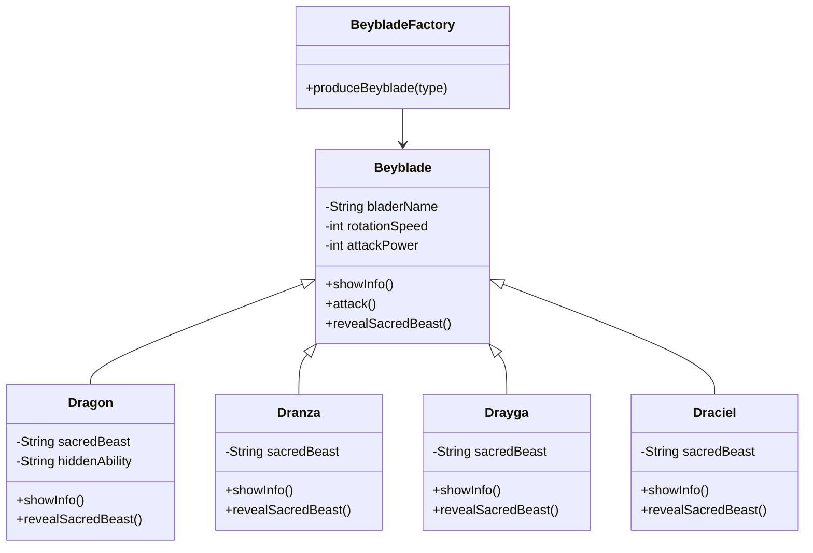
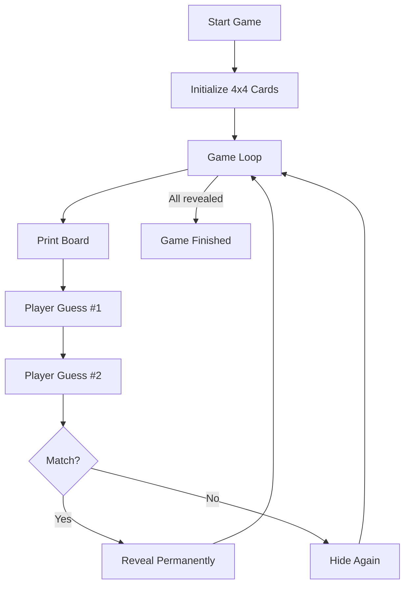

# Beyblade App (Object-Oriented Beyblade Simulation)

This project is a simple Java application designed to demonstrate Object-Oriented Programming (OOP) through a Beyblade-themed simulation.
It showcases inheritance, polymorphism, method overriding, and the Factory Design Pattern in a clean and understandable way.

## 📌 Project Overview

The program lets the user create different Beyblade types through a factory.
Each Beyblade has:

A unique sacred beast

Different stats

Special attack animations

Shared base properties inherited from the Beyblade class

The project is fully console-based and ideal for Java OOP practice.

## 🧩 Features

Four Beyblade types: Dragon, Dranza, Drayga, Draciel

Base class: Beyblade

Overridden methods:

showInfo()

attack()

revealSacredBeast()

Factory class that generates objects based on user input

Easy-to-follow console interaction

## 🛠️ Technologies Used

Java 8+

OOP Principles

Inheritance

Polymorphism

Encapsulation

Factory Pattern

Console I/O (Scanner)

## 📁 Folder Structure

mini-java-projects/
│
└── BeybladeApp/
    ├── Beyblade.java
    ├── Dragon.java
    ├── Dranza.java
    ├── Drayga.java
    ├── Draciel.java
    ├── BeybladeFactory.java
    └── Test.java

## 🧪 Getting Started

Follow these steps to run the project locally:

### 1️⃣ Clone the repository and directly enter BeybladeApp folder

git clone https://github.com/berattansu/mini-java-projects.git

cd mini-java-projects/BeybladeApp

### 2️⃣ Compile all Java files

javac *.java

### 3️⃣ Run the program

java Test

## 🧬 UML Class Diagram (Mermaid)

## 🔁 Program Flow (Flowchart)

## ▶️ Example Run

Welcome to the Beyblade Program...
Press 'Q' to exit.

Which Beyblade would you like to produce?

Dragon

Blader Name: Takao

Attack Power: 300

Rotation Speed: 800

Sacred Beast Name: Blue Dragon

Hidden Ability: Communicating with the Sacred Beast

Takao attacks with 300 and 800 rotation speed...

Takao is summoning Blue Dragon...

Takao's Attack: Phantom Cyclone

## 🎯 Purpose of the Project

This is a small Java OOP practice project designed to reinforce:

Class inheritance

Method overriding

Polymorphism

Factory Pattern

## 📄 License

This project is open-source.

You may use, modify, or extend it freely.
