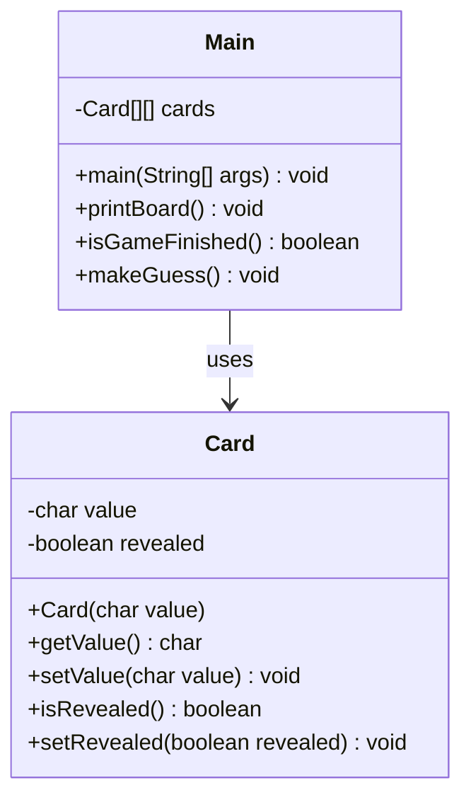
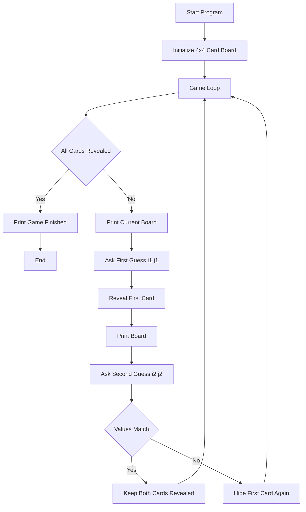

# Memory Match Game (2D Array Card Matching)

This project is a simple console-based Java game that demonstrates how to use 2D arrays, basic game logic, and object-oriented programming with a small card-matching “memory” game.

The player tries to find matching pairs on a 4x4 board by entering coordinates.

---

## 📌 Project Overview

- The game board is a **4x4 grid** of `Card` objects.
- Each card holds a character value (A, B, C, …) and a `revealed` state.
- The player selects two positions (i, j) per turn.
- If the values match, both cards stay revealed.
- If not, the first card is flipped back.
- The game ends when **all cards are revealed**.

---

## 🧩 Features

- 4x4 memory game using a **2D array** (`Card[][]`).
- `Card` class to encapsulate:
  - value (char)
  - revealed state (boolean)
- Simple text-based board rendering.
- Input-driven gameplay using `Scanner`.
- Clear game loop:
  - show board  
  - take guesses  
  - check match  
  - repeat until finished

---

## 🛠️ Technologies Used

- Java 8+
- 2D Arrays
- Basic OOP (classes & objects)
- Encapsulation (getters/setters)
- Console I/O (`Scanner`)

---

## 📁 Folder Structure

```text
src/
│
├── Card.java
└── Main.java
```

## 🧪 Getting Started

### 1️⃣ Clone the Repository

git clone https://github.com/berattansu/mini-java-projects.git

### 2️⃣ Go to the Project Folder

cd mini-java-projects/CardMatchGame

### 3️⃣ Compile the Java Files

javac *.java

### 4️⃣ Run the Game

java Main

## 🧬 UML Class Diagram (Mermaid)


## 🧩 Program Flow (Flowchart)




## ▶️ How It Works (Step-by-Step)

The board is pre-filled with pairs of characters (A–H) in a 4x4 grid.

The game shows the current board:

Revealed cards show their value.

Hidden cards appear as empty slots (| |).

The player enters the coordinates for:

First guess → i1 j1

Second guess → i2 j2

If the two cards have the same value:

Both stay revealed.

A “Correct Match!” message is printed.

If they are different:

A “Wrong Match!” message is printed.

The first card is flipped back (hidden again).

Steps 2–5 repeat until all cards are revealed.

## 📷 Example Run

____________________________
 | |  | |  | |  | | 
____________________________
 | |  | |  | |  | | 
____________________________
 | |  | |  | |  | | 
____________________________
 | |  | |  | |  | | 
____________________________
First Guess: (Enter i and j separated by space)
0 1
____________________________
 | |  |A|  | |  | | 
____________________________
 | |  | |  | |  | | 
____________________________
 | |  | |  | |  | | 
____________________________
 | |  | |  | |  | | 
____________________________
Second Guess: (Enter i and j separated by space)
1 1
Correct Match!

____________________________
 | |  |A|  | |  | | 
____________________________
 | |  |A|  | |  | | 
____________________________
 | |  | |  | |  | | 
____________________________
 | |  | |  | |  | | 
____________________________
First Guess: (Enter i and j separated by space)
...


...

Game continues until all pairs are found.

## 🎯 Purpose of the Project

This mini project was created to practice:

  Working with 2D arrays in Java

  Structuring a small game using OOP

Managing state with a simple game loop

Reading and validating user input from the console

It’s a compact example suitable for beginners who want to see how logic + arrays + classes come together in a real program.

## 📄 License

This project is open-source.

You can use, modify, or extend it freely.
