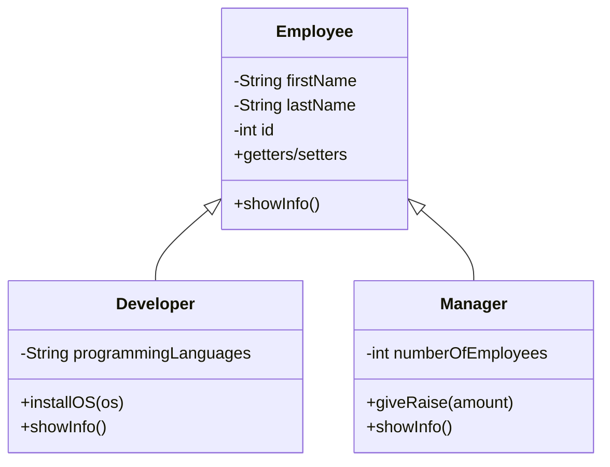
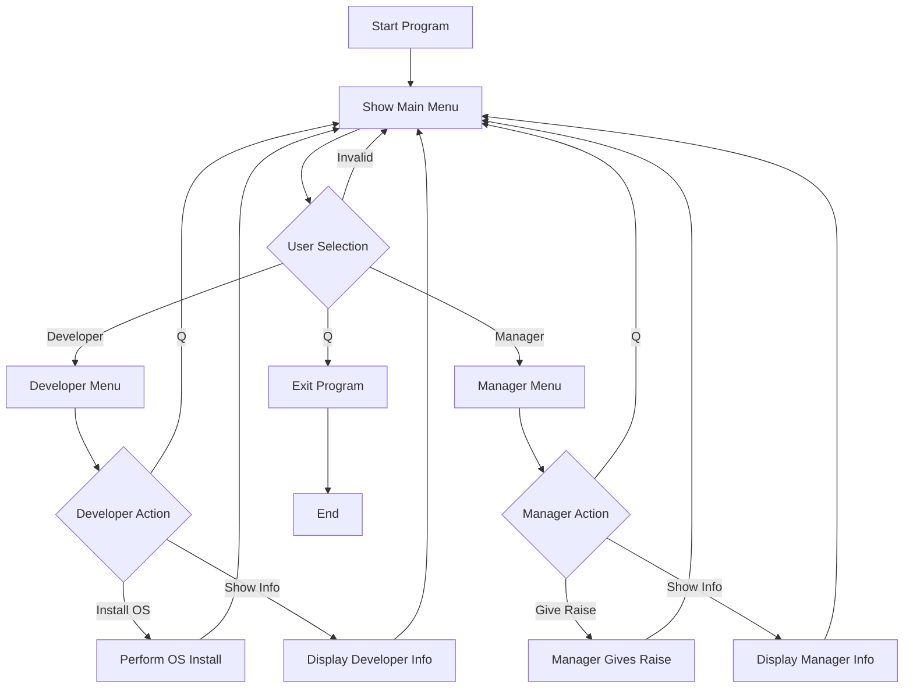

# Employee Management System (Java OOP)

This project is a simple Java application that demonstrates core Object-Oriented Programming (OOP) principles using an employee-based system.
It includes inheritance, polymorphism, method overriding, encapsulation, menu-based user interaction, and real-time console input.

## 📌 Project Overview

The system lets the user perform operations on two employee types:

Developer

Manager

Each employee type extends a shared base class (Employee) and adds its own unique behaviors.

## 🧩 Features
### ✔️ Object-Oriented Concepts

Inheritance (Developer & Manager inherit Employee)

Polymorphism (overridden showInfo() methods)

Encapsulation (private fields + getters/setters)

Method Overriding

Composition (menu-driven program flow)

### ✔️ Functional Features

Developers can install an Operating System

Managers can give a raise

User-friendly text-based menu navigation

Continuous program loop until user quits (q)

## 🛠️ Technologies Used

Java 8+

OOP Principles

Console I/O (Scanner)

Encapsulation, Inheritance, Polymorphism

## 📁 Folder Structure

src/
│
├── Employee.java
├── Developer.java
├── Manager.java
└── Main.java

## 🧪 Getting Started

Follow the steps below to run the project locally:

### 1️⃣ Clone the Repository

git clone https://github.com/berattansu/mini-java-projects.git

### 2️⃣ Navigate to the Employee System Folder

cd mini-java-projects/EmployeeSystem

### 3️⃣ Compile Java Files

javac *.java

### 4️⃣ Run the Program

java Main

## 🧬 UML Class Diagram (Mermaid)

## 🔁 Program Flow (Flowchart)

## ▶️ Example Run

Welcome to the Employee Management System...

------------------------------------------

1. Developer Operations

2. Manager Operations

Press 'q' to exit

------------------------------------------

Choose an operation:

1

Developer Menu:

1. Install OS

2. Show Info

Press 'q' to exit

Choose:

1

Enter Operating System:

Windows

Berat is installing Windows...

## 🎯 Purpose of the Project

This project serves as a small but effective demonstration of OOP fundamentals and simulates real-life employee operations.

It is designed as a clean and simple mini-project for learning and practicing Java OOP.

## 📄 License

This project is open-source.

Feel free to use, modify, or extend it as you like.
