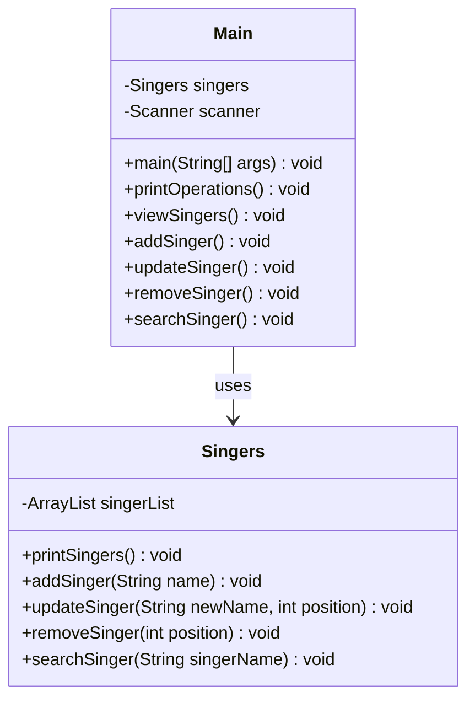

# 🎤 Singer Management System (ArrayList Implementation)
This project is a simple console-based Java application that simulates a database for managing a list of singers. It serves as a practical demonstration of using the ArrayList structure, essential input/output (I/O) operations with Scanner, and basic Object-Oriented Programming (OOP) principles.

The application allows users to add, view, update, remove, and search for singers in a dynamic list.

## 📌 Project Overview
The core data structure is a Java ArrayList<String>, which dynamically stores the names of the singers.

The application is split into two classes:

Singers: Handles all the business logic (adding, removing, updating the list).

Main: Provides the user interface, handles input, and manages the operation flow.

All operations are menu-driven and managed via a main application loop.

## 🧩 Key Features
Dynamic List Management: Uses ArrayList to manage singer names efficiently.

CRUD Operations: Supports Create (Add), Read (View), Update, and Delete (Remove) functionalities.

Search Functionality: Allows searching for a specific singer by name using the indexOf() method.

Menu-Driven Interface: Clear command-line interface guided by numbered options.

0-Based vs. 1-Based Indexing: Handles the conversion between user-friendly 1-based index input and Java's internal 0-based ArrayList indexing.

## 🛠️ Technologies Used
Java 8+

ArrayList (Dynamic List)

Basic OOP (Classes & Methods)

Encapsulation

Console I/O (Scanner)

## 📁 Folder Structure

src/
│
├── Singers.java   // The class that manages the ArrayList and business logic
└── Main.java      // The main class that handles the user interface and program flow

## 🧪 Getting Started

To run the Singer Management System, follow these steps in your terminal:

### 1️⃣ Clone the Repository
git clone https://github.com/berattansu/mini-java-projects.git

### 2️⃣ Navigate to the Project Folder
cd mini-java-projects/SingersSystem

### 3️⃣ Compile the Java Files
javac *.java

### 4️⃣ Run the Application
java Main

## 🧬 UML Class Diagram (Mermaid)


## 🔁 Program Flow (Flowchart)
The flowchart visualizes the sequence of operations within the main application loop:
```mermaid
flowchart TD
    A[Start Program] --> B[Initialize Singers and Scanner]
    B --> C[Display Menu]

    C --> D[Game Loop: while isRunning]

    D --> E[Ask User to Select Operation (0-6)]
    E --> F{Operation Choice?}

    F -->|0| C
    F -->|1| G[Call viewSingers()]
    G --> D

    F -->|2| H[Call addSinger()]
    H --> D

    F -->|3| I[Call updateSinger()]
    I --> D

    F -->|4| J[Call removeSinger()]
    J --> D

    F -->|5| K[Call searchSinger()]
    K --> D

    F -->|6| L[Set isRunning = false]
    L --> M[End Program]
    
    F -->|Invalid| N[Show Error]
    N --> D
```

## ▶️ How It Works (Step-by-Step)
The application starts by displaying a menu of available operations:

1. Welcome: Displays the welcome message and the initial list of commands.

2. Input: The user selects an operation number (0-6).

3. Execute Operation:
   View (1): Calls singers.printSingers() to list all current entries.
   
   Add (2): Prompts for a name and calls singers.addSinger().
   
   Update (3): Prompts for a 1-based position and a new name, then calls singers.updateSinger(name, position - 1).
   
   Remove (4): Prompts for a 1-based position and calls singers.removeSinger(position - 1).
   
   Search (5): Prompts for a name and calls singers.searchSinger().

5. Loop: After each operation, the user is prompted to select the next action until they choose option 6 to exit.

## 📷 Example Run
Welcome to the Singer Application...

     0 - View Operations
     
     1 - View Singers
     
     2 - Add Singer
     
     3 - Update Singer
     
     4 - Remove Singer
     
     5 - Search Singer
     
     6 - Quit Application

***********************************

Select an Operation: 2

Enter the name of the singer you want to add:

Adele

Singer list has been updated...

Select an Operation: 1

There are 1 singers in the list.

1. Singer: Adele

Select an Operation: 5

Enter the name of the singer you want to search for:

Adele

Singer found!

Adele is at position 1

Select an Operation: 6

Exiting Application...

## 🎯 Purpose of the Project
This mini project was designed to practice and understand:

    Dynamic Data Structures: The fundamental usage and flexibility of the ArrayList.

    Encapsulation: Separating the data management logic (Singers.java) from the user interaction logic (Main.java).

    Input Handling: Reading user input and making necessary conversions (like 1-based index to 0-based index) for effective processing.

    Menu Interface: Structuring a simple but complete user experience using a loop and switch statement.

## 📄 License
This project is open-source and licensed for free use.
